# Project Document: Tech Trolley - Equipment Inventory and Rental Tracking System

## Introduction
The Tech Trolley Equipment Inventory and Rental Tracking System is a specialized software solution designed to help AV and event management companies manage their equipment inventory, conference bookings, and the complete tracking of rental equipment. Built with real-time barcode and QR code scanning capabilities, the system allows staff to efficiently handle the rental process from initial booking to venue delivery, and finally to warehouse return. With this system, companies can optimize their warehouse operations, drastically reduce equipment loss, and streamline their business processes.

## Objective
The primary objective of the Tech Trolley system is to provide a user-friendly, scalable, and efficient solution that allows AV companies to manage their equipment inventory and event rental processes effectively. The system aims to help companies to:
- Manage conference bookings and equipment inventory in real-time.
- Simplify the dispatch and return process using a mobile-friendly QR/Barcode scanning interface.
- Prevent equipment loss by enforcing strict scanning workflows before dispatch and upon return.
- Track specific kit components (sub-assets) to ensure no accessories are left behind.
- Monitor asset health and statuses (Available, In Use, Damaged, Crosscheck).
- Automatically generate Delivery Challans and billing summaries to enhance tracking operations.

## Features

### 1. Inventory Management & Asset Inward
The system will track the addition of equipment and log all relevant technical and valuation information.

**TASK 1: Capture Equipment Details**
- User enters the details of the new equipment:
  - SKU / Serial Number / IMEI / MAC Address
  - Alias Name and Description
  - Category (Sound, AV, IT, Lighting, LED Wall, Truss, Power)
  - Purchase Details (Date, Item Price, Depreciation)
- User submits the form.

**TASK 2: Sub-Asset / Component Linking**
- User can link "child" assets to a "parent" asset (e.g., microphones grouped into a larger AV rack).
- System logically groups these items to ensure they are scanned together during checkout.

**TASK 3: Real-Time Inventory Updates & QR Generation**
- Newly added equipment is logged directly to the central database.
- System can associate existing barcodes or trigger the creation of unique QR Code labels for physical tagging.

### 2. Classification of Equipments and Status Tracking
Equipments can be classified based on usage and current operational state.

**TASK 1: Condition and Status Flow**
- Equipments are strictly categorized into statuses: `Available`, `In Use`, `Damaged`, and `Crosscheck`.
- The dashboard populates visual charts (Bar Graphs and Pie Charts) based on live classifications.

### 3. Conference / Rental Order Booking
The system will allow for the booking of conferences (rental orders) and reserve specific item categories for the event.

**TASK 1: Booking Placement**
- Staff places a conference booking by specifying:
  - Event / Conference Name & Association Name
  - Venue Address & Billing Address
  - Start Date and End Date
  - Contact Person Details
- The system generates a unique record for the event booking.

### 4. Dispatch Management (QR Scanning)
The system lists order items with a robust scanning workflow, acting as a mobile device-compatible checklist for warehouse staff.

**TASK 1: Scanning Out Items (Dispatch)**
- Staff navigates to the specific Conference booking on their mobile device or PDA.
- Staff scans the barcodes/QR codes of the items to be dispatched to the venue.
- The system validates the scan against the database. If recognized, the item is moved to the "Assigned" list for the event.

**TASK 2: Sub-Asset Validation**
- If a scanned item has child components, the system immediately presents a warning and requires staff to scan all associated sub-assets before the item is fully confirmed as dispatched.
- System safely transitions the scanned items' statuses to `In Use`.

### 5. Delivery Challan & Vehicle Departure
The system captures the departure of the equipment and finalizes the documentation.

**TASK 1: Challan Generation**
- Once items are appropriately scanned and assigned to the conference, staff can generate a "Delivery Challan".
- System automatically assigns a unique Challan Number, capturing the transport details, GST, and vehicle assignment.
- This Challan is printable and serves as the official invoice/manifest.

### 6. Equipment Loading from the Venue (Return Scanning)
The system facilitates the safe pickup of rental items from the venue using reverse-scanning logic.

**TASK 1: Item Confirmation at Venue**
- Staff uses the mobile scanning interface at the venue while loading the truck.
- They scan items to remove them from the active "Assigned" tab of the conference.
- The system shifts the status of these scanned items to `Crosscheck` (moving them temporarily to Godown Crosscheck status rather than immediately making them Available).

**TASK 2: Missing Items Flag**
- Any item associated with the conference that has NOT been scanned will remain in the "Assigned" list, visibly raising an alert about what is currently missing at the venue.

### 7. Warehouse Verification (Godown Crosscheck)
The system requires a final layer of confirmation once the truck unloads back at the main store.

**TASK 1: Final Unloading Confirmation**
- Items brought back from the venue are in the `Crosscheck` state.
- Inventory managers scan these items one final time in the warehouse.
- The system recognizes this final return, officially breaking the link with the Conference, and updates the item's status back to `Available` on the shelf.

---

## System Architecture & User Flow Diagram

